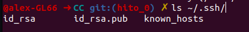
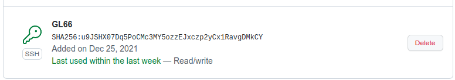
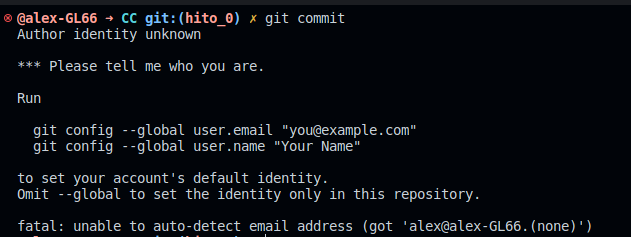
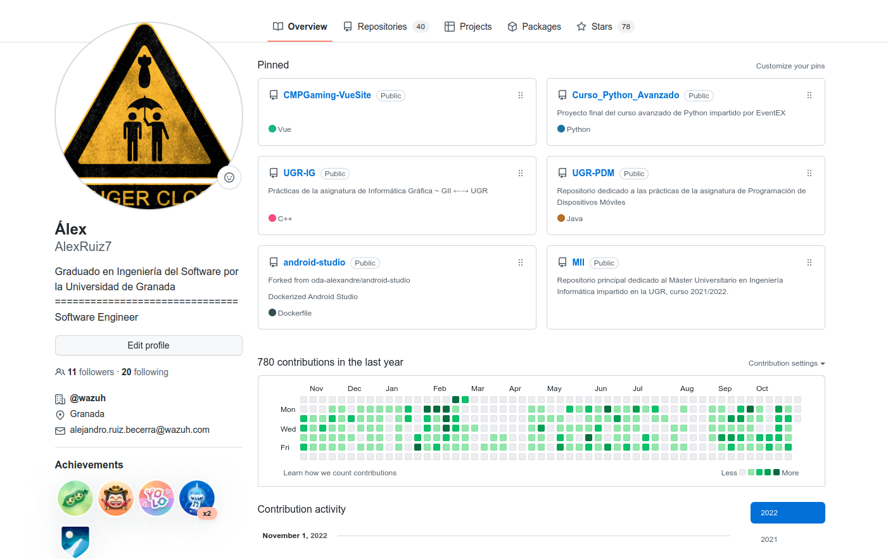
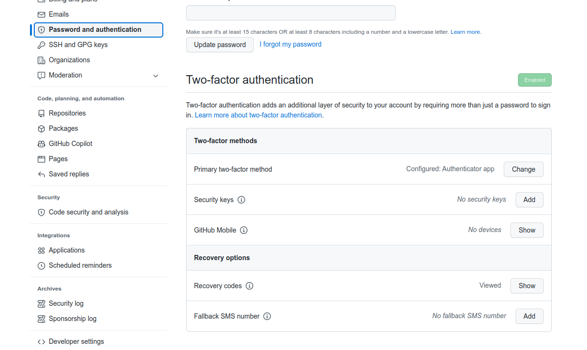

# Hito 0

En este primer hito, se inicializa y configura tanto el entorno de control de
versiones (Git y GitHub), como el repositorio actual, al que se irá añadiendo 
el código fuente del proyecto.

En mi caso particular, soy usuario de GitHub desde hace años, y lo uso de forma 
prácticamente diaria, por lo que todos los pasos realizados a continuación ya 
los habñia hecho hace tiempo. Por este motivo, tan solo se muestran los pasos 
necesarios y las evidencias, pero no se ha vuelto a realizar la configuración.

## Configuración del entorno

### Generación de claves SSH

Para crar las claves SSH, usamos la utilidad (normalmente pre-instalada en sistemas Linux)
[OpenSSH](https://www.openssh.com/):

```bash
ssh-keygen
```

Se siguen las indicaciones del programa, dando como resultado un par de claves
SSH, privada y pública, cuyos nombres por defecto son `id_rsa` e `id_rsa.pub`, 
respectivamente.



Por defecto, estas claves se almacenan en el directorio `~/.ssh`. Para configurar 
GitHub, copiamos la clave pública y la importamos a nuestra cuenta mediante la 
[aplicación web](https://github.com/settings/keys).




### Configuración de nombre y correo electrónico a mostrar en los commits

Para configurar el nombre y el correo electrónico que utilizarán para realizar los
commits, utilizamos los siguientes comandos:

```bash
git config user.email "you@example.com"
git config user.name "Your Name"
```

Si intentamos realizar un commit antes de realizar esta cofniguración, Git nos 
alertará de que debemos configurar estas opciones, abortando el proceso de commit.
Como tan solo se pretende configurar las opciones para este repositorio concreto,
omito el flag `--global`. Con este flag, se configura la identidad del autor para
todos los repositorios Git con los que se trabaje usando el equipo que estamos 
utilizando.



### Configuración de nuestro perfil público de GitHub

Para completar un poco el perfil, se añade una imagen de perfil, así como una 
breve descripción, correo electrónico, ciudad y organización a la que pertenecemos, 
si la hubiera.



### Configurando 2FA

Finalmente, aumentamos la seguridad de nuestra cuenta de GitHub habilitando la 
autenticación en dos pasos.

