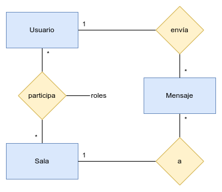

# Entidades del sistema - Recursos REST

Las entidades que componen el sistema son las siguientes:

- Usuario. 
- Salas de conversación.
- Mensaje.

Como resultado de la relación Usuario-Sala surge la sub-entidad **rol**, mediante
la cual se podrán definir permisos básicos para la administración de las salas
de conversación (owner, admin, moderator, readonly, ...)

Un esquema básico entidad-relación del sistema puede observase a continuación:

*Esquema entidad relación básico del sistema*